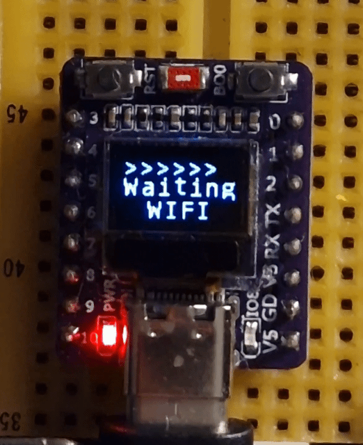
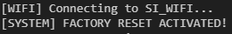

# Wake-on-LAN for ESP32-C3 (Zephyr RTOS)

*A Zephyr RTOS port and enhancement of the original [Wake-on-LAN_ESP32](https://github.com/sergio-isidoro/Wake-on-LAN_ESP32)*

This project provides a complete, robust, and asynchronous **Wake-on-LAN (WoL)** solution specifically tailored for the **ESP32-C3 SuperMini**. It features a captive portal for easy configuration, persistent storage, and a specialized UI for 0.42" OLED displays.

---

## ✨ Key Features

* **Captive Portal Configuration:** No need to hardcode credentials. If no config is found, the device starts an Access Point (`WOL_ESP`) with a DNS redirector and HTTP server for easy setup.
* **Persistent Storage (NVS):** Wi-Fi credentials, Target MAC, and Target IP are saved securely in the ESP32 internal Flash using the Zephyr Non-Volatile Storage (NVS) file system.
* **Factory Reset:** Holding the BOOT button (GPIO 9) for 5 seconds wipes all saved settings and reboots the device into Portal Mode.
* **Dual Trigger Support:** * **Main (BOOT):** Triggers the Magic Packet and handles Factory Reset.
    * **Auxiliary (GPIO 0):** Support for an extra physical trigger or flag.
* **System Reliability:** * **Hardware Watchdog (WDT):** 3-second timeout to automatically recover the system from network hangs.
    * **Asynchronous Workqueues:** WoL packet dispatch and ICMP Ping checks are offloaded from ISRs for maximum stability.
* **OLED UI (SSD1306):** Optimized for **0.42" (72x40)** screens.
    * **Smart IP Filtering:** Displays only the relevant last two octets (e.g., `1.222`) to fit the tiny screen.
    * **Heartbeat Animation:** A dynamic `>>>>>>>` indicator shows the system is actively monitoring the network.

---

## 🛠️ Hardware Requirements

* **Microcontroller:** ESP32-C3 SuperMini.
* **Display:** 0.42" OLED (SSD1306) via I2C (SDA: GPIO 5, SCL: GPIO 6).
* **LED:** Internal Blue LED on **GPIO 8**.
* **Buttons:** * **Main (BOOT):** GPIO 9 (Trigger WoL / Factory Reset).
* **Target PC:** Must support Wake-on-LAN and allow ICMP Echo Requests (Ping).

---

## 📂 Project Structure

* `src/main.c`: Core orchestration, Factory Reset logic, and Watchdog feeding.
* `src/portal.c`: Captive Portal implementation (DNS Redirector + HTTP Server).
* `src/storage.c`: NVS Flash management for persistent configurations.
* `src/wifi.c`: Wi-Fi connectivity, DHCP, and ICMP (Ping) monitor task.
* `src/display.c`: Multithreaded OLED rendering with dirty-check optimization.
* `src/button.c`: GPIO interrupt handling for physical triggers.
* `src/notify.c`: LED patterns and UI refresh synchronization.
* `esp32c3_supermini.overlay`: Devicetree definitions for partitions, I2C, and GPIOs.

---

## 🚀 Quick Start

1.  **Build:**
    ```bash
    west build -p always -b esp32c3_supermini .
    ```
2.  **Flash:**
    ```bash
    west flash
    ```
3.  **Setup:** * On first boot, connect to **`WOL_Config_ESP32`** Wi-Fi.
    * The portal will open automatically. Enter your Wi-Fi SSID/PASS and the Target PC's MAC/IP.
    * Save and the device will reboot to start monitoring your PC.

---

## 🖥️ Display States

### 1. Portal Mode (Configuration)
| Line | Content | Description |
| :--- | :--- | :--- |
| **Top** | `WOL_ESP` | Static header for Configuration Mode. |
| **Middle**| `192.168` | Portal IP (Part 1). |
| **Bottom**| `.4.1` | Portal IP (Part 2). |

### 2. Connecting Mode
| Line | Content | Description |
| :--- | :--- | :--- |
| **Top** | `>>>>>>>` | Activity heartbeat. |
| **Middle**| `Waiting` | Status message. |
| **Bottom**| `WIFI` | Pending network connection. |

### 3. Operation Mode (Station)
| Line | Content | Description |
| :--- | :--- | :--- |
| **Top** | `>>>>>>>` | Real-time refresh indicator. |
| **Middle**| `1.111` | ESP32 IP (Last two octets, e.g., 192.168.**1.111**). |
| **Bottom**| `* 1.222` | `*` = Online / `x` = Offline + Target PC IP octets. |

---

## Image





