# Wake On LAN — ESP32 DevKitC/Supermini (Zephyr RTOS)

A Zephyr RTOS application for the ESP32 DevKitC / Supermini that sends Wake-on-LAN magic packets to wake a target PC on the local network, featuring a 1.54" ST7789V TFT display with a custom dark-themed LVGL interface showing real-time connection status and target PC state.

---

## Display previews

| Splash screen | Connecting | Connected — ON |
|:---:|:---:|:---:|
| 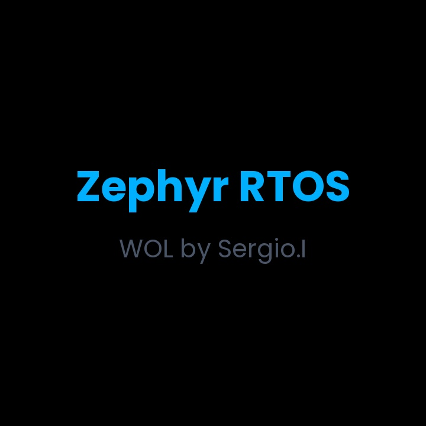 | 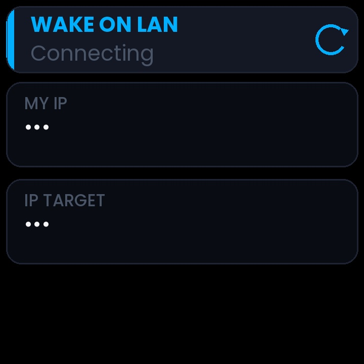 | 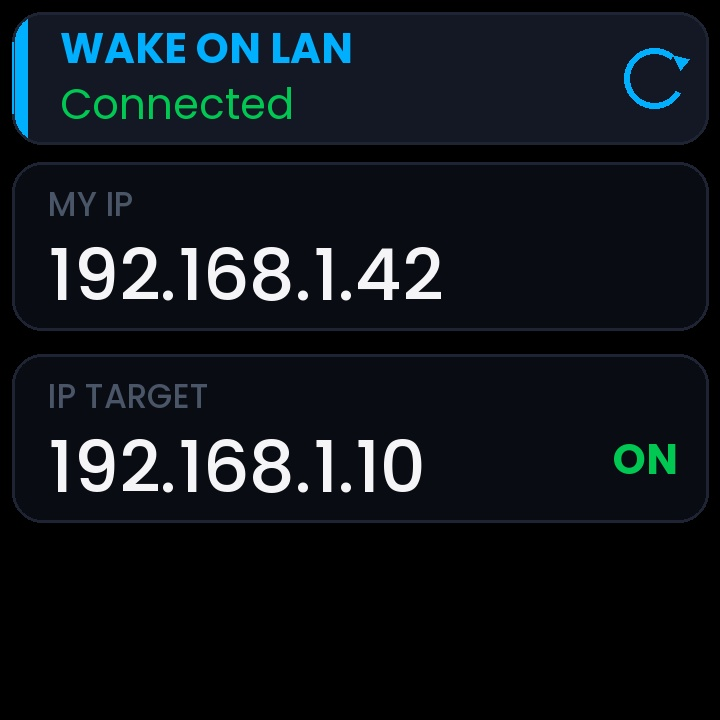 |

| Connected — OFF | WoL Sent | Factory Reset | AP Mode |
|:---:|:---:|:---:|:---:|
| 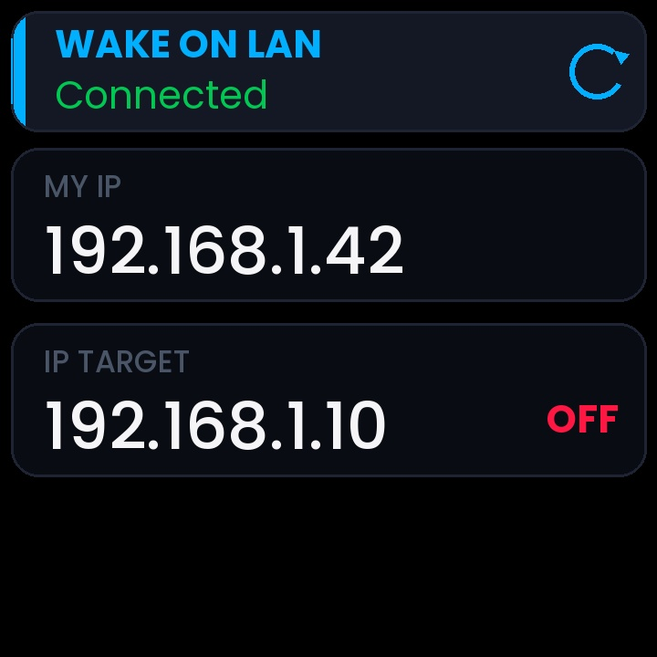 | 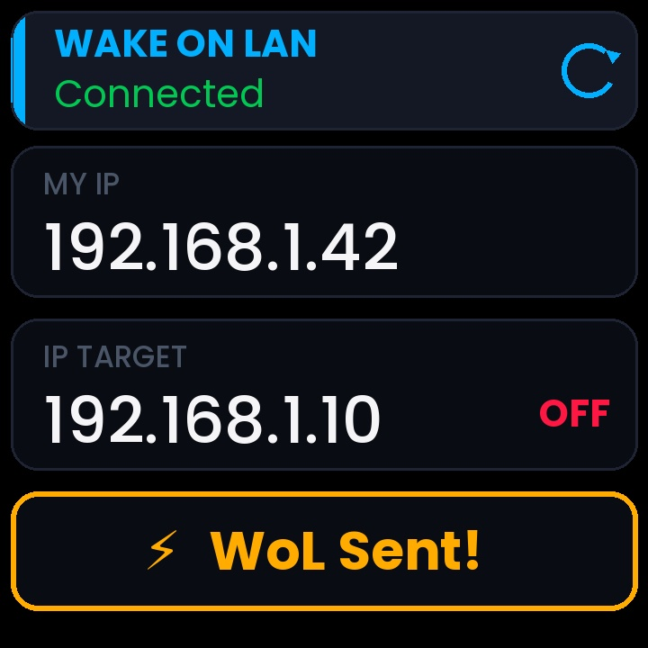 | 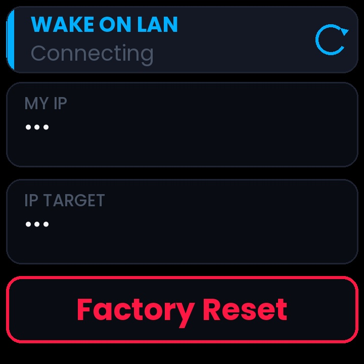 | 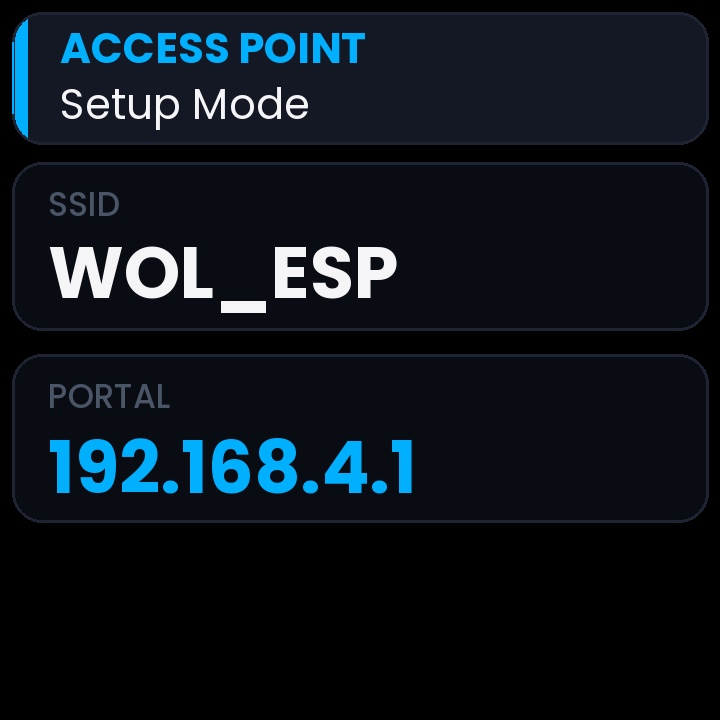 |

---

## Features

- **Wake-on-LAN** — sends a standard 102-byte UDP magic packet (broadcast on port 9) to wake a target PC via its MAC address; triggered instantly by pressing the BOOT button
- **Captive Portal** — on first boot (or after factory reset), the device creates a Wi-Fi Access Point (`WOL_ESP`, open, channel 1) with a full captive portal stack: DHCP server (assigns `192.168.4.2`), DNS redirector (intercepts all queries to `192.168.4.1`), and an HTTP server hosting a dark-themed configuration page for entering SSID, password, target IP, and target MAC
- **Form validation** — the portal validates all fields client- and server-side: IP format via `inet_pton`, MAC format via regex (`AA:BB:CC:DD:EE:FF`), and non-empty SSID; invalid submissions show an inline error banner without reloading the page
- **Persistent configuration** — credentials and target settings stored in NVS flash (3 sectors at `0x3F0000`, 64 KB partition); survives reboots and power cycles
- **ICMP ping monitor** — once connected, periodically pings the target PC with up to 3 sequential attempts (1 s apart) before declaring offline; reschedules every 60 s and updates the display with ON/OFF state in real-time
- **Auto-reconnect** — on Wi-Fi disconnection the device automatically resets IP state, stops DHCP, and retries connection after a 3 s delay
- **TFT display** — 240×240 ST7789V driven over SPI3 (MIPI DBI 4-wire) via LVGL; features a custom "Midnight Ultra" dark theme with card-based layout, animated spinner, dot-pulse connecting animation, color-coded status (green = connected/ON, red = OFF), and gold flash bar for WoL/factory-reset events
- **PWM backlight** — display backlight brightness controlled via LEDC PWM (GPIO 15), defaulting to 20%; adjustable programmatically through `set_backlight_brightness()`
- **Splash screen** — on boot, displays "Zephyr RTOS" and "WOL by Sergio.I" for 3 seconds before transitioning to the main UI
- **Hardware watchdog** — MWDT1 armed with an 8 s timeout, fed every 4 s from a dedicated high-priority thread; resets the SoC on any software hang
- **LED notification** — blue LED (GPIO 2) blinks on events: 2 blinks (500 ms ON, 200 ms OFF) for WoL sent, 1 blink (500 ms ON) for ping state change
- **Boot button** — short press (< 1 s) sends a magic packet immediately; long press (≥ 1 s) while not yet connected triggers a factory reset: erases NVS, shows a red "Factory Reset" bar on the display for 2 s, turns off the backlight, and reboots into portal mode
- **Stack overflow protection** — stack sentinel enabled on all threads for early detection of overflows

---

## Hardware

| Component | Details |
|---|---|
| Board | ESP32 DevKitC / Supermini |
| Display | 1.54" TFT ST7789V, 240×240, SPI |
| Button | BOOT button (GPIO 0, active-low with internal pull-up) |
| LED | Blue LED (GPIO 2, active-high) |
| Backlight | PWM via LEDC channel 0 (GPIO 15) |

### Display wiring (SPI3 / VSPI)

| Display pin | ESP32 GPIO | Function |
|---|---|---|
| MOSI | GPIO 23 | SPI data out |
| SCLK | GPIO 18 | SPI clock |
| CS | GPIO 5 | SPI chip select (hardware) |
| DC | GPIO 21 | Data/Command select |
| RST | GPIO 17 | Display reset (active-low) |
| BL | GPIO 15 | Backlight (PWM controlled) |
| VCC | 3.3 V | Power supply |

---

## Captive Portal

On first boot (or after factory reset) the device starts in AP mode. Connect to `WOL_ESP` (open network) and open `192.168.4.1` in a browser. The captive portal includes a complete network stack: a DHCP server that assigns IP addresses to clients, a DNS server that redirects all domain queries to the portal, and an HTTP server that serves the configuration form.

### Configuration form

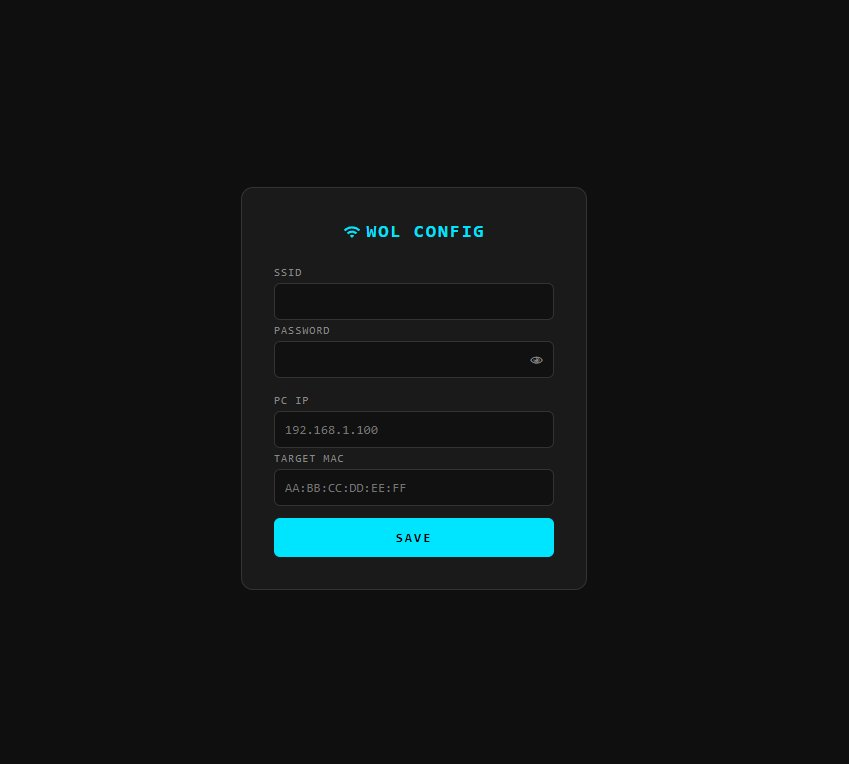

Fill in SSID, password (with show/hide toggle), target PC IP, and MAC address, then press **SAVE**.

### Validation

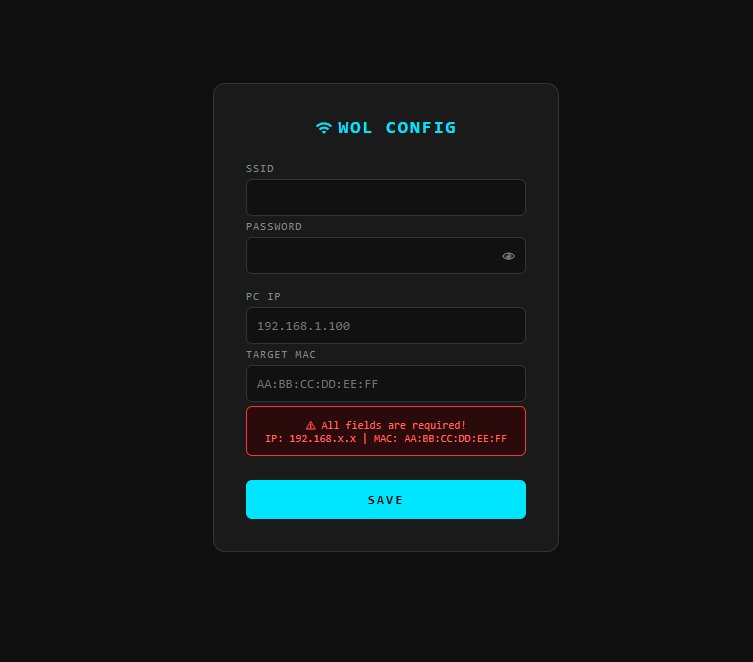

If any field is missing or the IP/MAC format is invalid, an inline error banner is shown without reloading the page. IP addresses are validated via `inet_pton()` and MAC addresses must match the `AA:BB:CC:DD:EE:FF` format.

### Saved

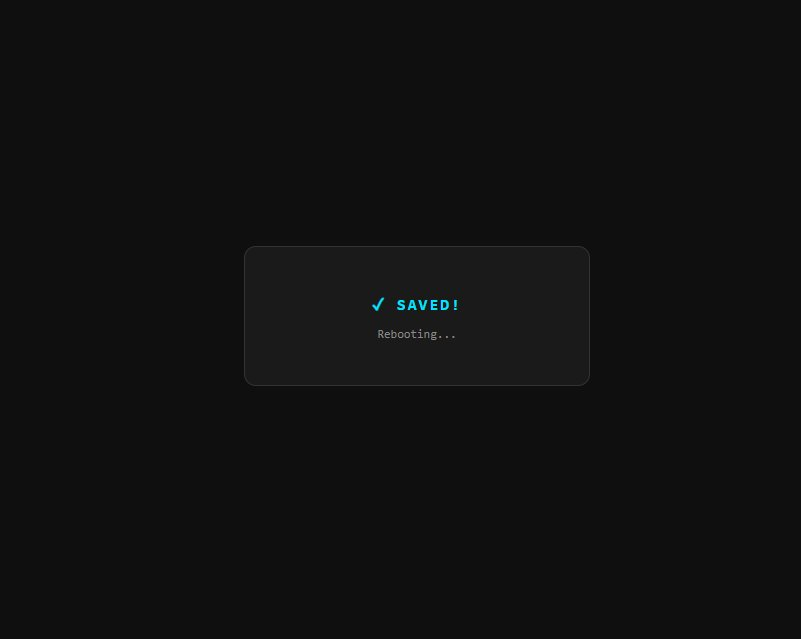

On success the page shows **✓ SAVED!** with a "Rebooting..." message. The credentials are written to NVS flash, and the device reboots into station mode after approximately 1 second.

---

## Serial output

Connect a serial monitor at **115200 baud** to observe runtime logs. The application uses Zephyr's logging subsystem at level 3 (INFO) by default.

### Wi-Fi connecting

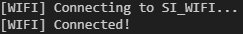

```
[WIFI] Connecting to <SSID>...
[WIFI] Connected!
```

### Wake-on-LAN sent

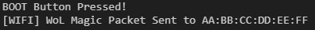

```
BOOT Button Pressed!
[WIFI] WoL Magic Packet Sent to AA:BB:CC:DD:EE:FF
```

### Factory reset


```
[WIFI] Connecting to <SSID>...
[SYSTEM] FACTORY RESET ACTIVATED!
```

To trigger a factory reset: hold the BOOT button for ≥ 1 second while the device is connecting to Wi-Fi (before an IP is obtained). The NVS storage is erased, the backlight turns off, and the device reboots into portal mode after 2 seconds.

---

## Display layout

The display uses a card-based UI with a dark "Midnight Ultra" palette. All elements are rendered via LVGL with Montserrat 14/24 fonts.

### Station mode (normal operation)

```
┌──────────────────────────┐
│ ▐  WAKE ON LAN      ⟳   │  ← header card: accent strip + animated spinner
│ ▐  Connected             │    subtitle: "Connecting" (grey) → "Connected" (green)
├──────────────────────────┤
│  MY IP                   │  ← IP card: shows "." / ".." / "..." while connecting
│  192.168.1.42            │    then device IP (white, 24 px)
├──────────────────────────┤
│  IP TARGET          ON   │  ← target card: target IP + state badge
│  192.168.1.10            │    ON (green) / OFF (red) via ICMP ping
├──────────────────────────┤
│      ⚡ WoL Sent!        │  ← event bar: gold flash for 2 s on WoL
│                          │    or red "Factory Reset" on long press
└──────────────────────────┘
```

### AP / portal mode

```
┌──────────────────────────┐
│ ▐  ACCESS POINT          │  ← header card with accent strip
│ ▐  Setup Mode            │
├──────────────────────────┤
│  SSID                    │
│  WOL_ESP                 │
├──────────────────────────┤
│  PORTAL                  │
│  192.168.4.1             │  ← portal IP in accent blue
└──────────────────────────┘
```

---

## Application flow

```
                    ┌─────────┐
                    │  BOOT   │
                    └────┬────┘
                         │
              ┌──────────▼──────────┐
              │  watchdog_init()    │  WDT1 armed @ 8 s
              │  notify_init()     │  blue LED GPIO
              │  button_init()     │  BOOT button ISR + thread
              │  storage_init()    │  NVS mount
              └──────────┬─────────┘
                         │
              ┌──────────▼──────────┐
              │  Read NVS config   │
              └──────────┬─────────┘
                    ┌────┴────┐
               has_creds?   no creds
                    │         │
          ┌────────▼───┐  ┌──▼────────────┐
          │ Station    │  │ AP Mode       │
          │ Mode       │  │ start_portal()│
          ├────────────┤  ├───────────────┤
          │ wifi_init  │  │ DHCP server   │
          │ DHCP client│  │ DNS redirect  │
          │ ping loop  │  │ HTTP form     │
          │ WoL ready  │  │ save → reboot │
          └────────────┘  └───────────────┘
```

---

## Build & flash

### Prerequisites

```bash
# Install Zephyr SDK and west (first time only)
pip install west
west init -m <this-repo-url> .
west update
west zephyr-export
pip install -r deps/zephyr/scripts/requirements.txt
west blobs fetch hal_espressif
```

### Build

```bash
west build -b esp32_devkitc/esp32/procpu .
```

### Flash

```bash
west flash
```

### Factory reset via flash (erase all NVS data)

```bash
west flash --runner esptool -- --erase-all
```

---

## Project structure

```
Wake_On_Lan/
├── CMakeLists.txt                         ← cmake config, auto-globs src/ and src/fonts/
├── prj.conf                               ← Zephyr Kconfig: Wi-Fi, LVGL, SPI, NVS, WDT, PWM
├── boards/
│   └── esp32_devkitc_procpu.overlay       ← DTS overlay: ST7789V SPI3, pinctrl, LEDC PWM,
│                                             NVS partition, button & LED nodes
├── assets/                                ← screenshots and GIFs for this README
├── inc/
│   ├── shared.h        ← inter-thread shared state struct (volatile fields + compiler barrier)
│   ├── display.h       ← display thread API (backlight control)
│   ├── wifi.h          ← Wi-Fi connect, WoL trigger, ping
│   ├── portal.h        ← captive portal (AP + DHCP + DNS + HTTP)
│   ├── portal_html.h   ← embedded HTML/CSS for the configuration page
│   ├── storage.h       ← NVS read/write/clear API
│   ├── button.h        ← button init and state query
│   └── notify.h        ← LED notification event types and API
└── src/
    ├── main.c          ← init sequence: WDT → notify → button → NVS → display → wifi/portal
    ├── display.c       ← LVGL thread: splash screen → AP or station UI, 30 ms render loop
    ├── wifi.c          ← Wi-Fi STA connect, DHCP, WoL (UDP broadcast), ICMP ping, auto-reconnect
    ├── portal.c        ← AP mode: DHCP server, DNS redirector, HTTP config server with validation
    ├── storage.c       ← NVS flash storage: 3 sectors, 4 keys (SSID, password, MAC, IP)
    ├── button.c        ← GPIO ISR → semaphore → dedicated thread: short press=WoL, long press=reset
    ├── notify.c        ← LED blink patterns via semaphore-driven thread
    └── fonts/
        ├── lv_font_wol.h      ← font declarations
        ├── lv_font_wol_14.c   ← custom 14 px font (ASCII + Unicode symbols)
        └── lv_font_wol_24.c   ← custom 24 px font (ASCII + Unicode symbols)
```

---

## Thread map

| Thread | Priority | Stack | Role |
|---|---|---|---|
| `main` | 0 | 6 KB | Init sequence, then sleeps forever (`k_sleep(K_FOREVER)`) |
| `display_id` | 7 | 4 KB | LVGL render loop: splash → AP/station UI; 30 ms tick (~33 FPS) |
| `button` | 5 | 2 KB | Dedicated press handler: polls release, measures hold time, triggers WoL or factory reset |
| `blink_tid` | 10 | 512 B | LED blink patterns: semaphore-driven, 500 ms ON / 200 ms OFF |
| `wdt_tid` | 14 | 512 B | WDT feed every 4 s (half of 8 s timeout) |
| `http_tid` | 7 | 4 KB | HTTP server (portal mode): serves config form, handles POST /save |
| `dhcp_tid` | 7 | 2 KB | DHCP server (portal mode): assigns `192.168.4.2` to clients |
| `dns_tid` | 8 | 2 KB | DNS redirector (portal mode): responds to all queries with `192.168.4.1` |
| System workqueue | — | 4 KB | WoL send, ping schedule, Wi-Fi reconnect (via `k_work` / `k_work_delayable`) |

---

## Inter-thread communication

All threads communicate through a global `shared_t` struct (`g_shared`) defined in `main.c`. The struct contains volatile fields for IP addresses, connection state, display mode, and event flags. Synchronization uses a compiler memory barrier (`shared_sync()`) rather than mutexes, which is safe because the display thread only reads and the field sizes are atomically writable on Xtensa.

| Field | Writer | Reader | Purpose |
|---|---|---|---|
| `my_ip[16]` | wifi.c | display.c | Device IP after DHCP lease |
| `target_ip[16]` | wifi.c | display.c | Target PC IP from NVS config |
| `has_ip` | wifi.c | display.c, button.c, wifi.c | IP obtained flag |
| `last_known_state` | wifi.c | display.c | Target PC online/offline (ICMP) |
| `ap_mode` | main.c | display.c | AP vs. station screen selection |
| `wol_sent` | wifi.c | display.c | Trigger gold "WoL Sent!" bar |
| `factory_reset` | button.c | display.c | Trigger red "Factory Reset" bar |

---

## Kconfig highlights

| Option | Value | Purpose |
|---|---|---|
| `CONFIG_MAIN_STACK_SIZE` | 6144 | Main thread stack for init + NVS reads |
| `CONFIG_SYSTEM_WORKQUEUE_STACK_SIZE` | 4096 | System workqueue for WoL/ping/reconnect |
| `CONFIG_HEAP_MEM_POOL_SIZE` | 49152 | 48 KB heap for networking + LVGL allocations |
| `CONFIG_LV_Z_VDB_SIZE` | 10 | LVGL display buffer at 10% of frame (~11.5 KB) |
| `CONFIG_LV_Z_DOUBLE_VDB` | n | Single buffer to save RAM |
| `CONFIG_LV_COLOR_16_SWAP` | y | Byte-swap for ST7789V SPI byte order |
| `CONFIG_WIFI_ESP32` | y | ESP32 native Wi-Fi driver |
| `CONFIG_STACK_SENTINEL` | y | Stack overflow detection on all threads |
| `CONFIG_PWM` | y | LEDC PWM for backlight brightness control |

---

## Devicetree overlay summary

The overlay (`boards/esp32_devkitc_procpu.overlay`) configures:

- **ST7789V display** — MIPI DBI SPI 4-wire mode on SPI3 at 20 MHz, 240×240 resolution, with gamma correction and color calibration parameters
- **SPI3 pinctrl** — SCLK on GPIO 18, MOSI on GPIO 23, CS on GPIO 5
- **LEDC PWM** — channel 0 on GPIO 15 for backlight control (5 kHz period)
- **BOOT button** — GPIO 0, active-low with internal pull-up
- **Blue LED** — GPIO 2, active-high
- **NVS partition** — 64 KB at flash offset `0x3F0000` (3 sectors)
- **Watchdog** — MWDT1 enabled

---

## Zephyr version

Tested with **Zephyr 4.3.0** and **zephyr-sdk-0.17.3**.
