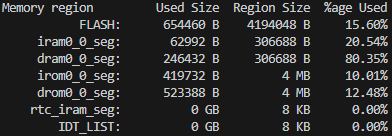

# Wake-on-LAN for ESP32-C3 (Zephyr RTOS)

*A Zephyr RTOS port and enhancement of the original [Wake-on-LAN_ESP32](https://github.com/sergio-isidoro/Wake-on-LAN_ESP32)*

This project provides a complete, robust, and asynchronous **Wake-on-LAN (WoL)** solution specifically tailored for the **ESP32-C3 SuperMini** using the native **Zephyr RTOS** network stack. 

It autonomously connects to a specified Wi-Fi network, negotiates an IPv4 address via the DHCP client, and leverages the onboard **BOOT button** to broadcast a Magic Packet. This allows you to remotely wake up any target computer on your local network with a simple physical button press.

---

## ✨ Key Features

* **Zephyr RTOS Native:** Fully abandons the Arduino core in favor of Zephyr's native `net_mgmt` API, ensuring reliable, non-blocking network event handling (built for Zephyr v4.3+).
* **Asynchronous Hardware Trigger:** Maps the onboard BOOT button (GPIO 9) via Zephyr's Devicetree and interrupts. The WoL packet dispatch is offloaded to system **Workqueues**, keeping the Interrupt Service Routine (ISR) clean and stable.
* **Real-time Network Monitor:** Includes a background **ICMP (Ping) monitor** that tracks the target PC's status. It performs an initial burst of 3 pings to bypass ARP delays and then checks the status every minute.
* **DHCP Client Integration:** Automatically fetches an IP address from your router and logs the network status and assigned IP directly to the serial console.
* **Standard UDP Broadcast:** Constructs and transmits an industry-standard 102-byte Magic Packet over UDP port 9 to the limited broadcast address (`255.255.255.255`).

---

## 🛠️ Hardware Requirements

* **Microcontroller:** ESP32-C3 SuperMini (or any compatible ESP32-C3 development board).
* **Network Environment:** The ESP32-C3 must be connected via Wi-Fi to the *same local router/subnet* as the target computer.
* **Target PC:** * Must be connected to the network via an **Ethernet cable** (Wake-on-LAN over Wi-Fi is rarely supported by standard motherboards).
    * **Wake-on-LAN** must be explicitly enabled in both the Motherboard's **BIOS/UEFI** (often under "APM" or "Power Management" -> "Power On By PCI-E/Wake Up On LAN") and the Operating System's **Network Adapter properties**.
    * **Firewall Note:** To allow the ESP32-C3 to detect the "ONLINE" status, ensure the target PC's firewall allows **ICMP Echo Requests (Ping)**.

---

## 📂 Project Structure

The project is organized into modular components for better maintainability:

* `inc/`: Contains header files (`wifi.h`, `button.h`).
* `src/wifi.c`: Handles Wi-Fi connection, DHCP events, ICMP Ping monitoring, and WoL packet generation.
* `src/button.c`: Manages GPIO configuration and interrupt handling for the physical button.
* `src/main.c`: The entry point that orchestrates the initialization of all modules.

## Image

